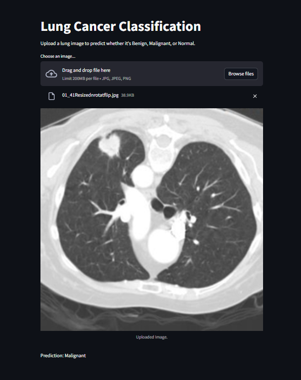

---

# Lung Cancer Classification and Detection Assistant 🫁

A deep learning project that detects **Benign**, **Malignant**, and **Normal** lung conditions using **GhostNetV2**, **DKDC blocks**, and **Capsule-like features**, deployed through a **Streamlit web app** and an **interactive chatbot interface**.

---

## 📂 Project Structure

```
├── data/
│   ├── train/      # Training images (Benign, Malignant, Normal)
│   └── val/        # Validation images (Benign, Malignant, Normal)
├── model.py        # LungClassifier model with GhostNetV2 + DKDC + Capsule-like layer
├── train.py        # Model training script
├── app.py          # Basic Streamlit app for single image prediction
├── chatbot_app.py  # Streamlit chatbot-style app for interactive prediction
├── lung_model.pth  # Trained model weights
├── requirements.txt # Python dependencies
└── README.md       # Project documentation (this file)
```

---

## 🚀 Project Overview

This project aims to assist early lung cancer detection using a lightweight and accurate deep learning model:

- **Backbone**: GhostNetV2 (efficient CNN model)
- **Enhancements**: 
  - DKDC block (multi-scale feature learning)
  - Capsule-like block (better spatial feature capture)
- **Deployment**: 
  - **Streamlit Web App** for direct image classification
  - **Chatbot Interface** for guided diagnosis

---

## 🧠 Model Architecture

- **GhostNetV2** pretrained on ImageNet
- **DKDC** block after backbone (3x3 and 5x5 convolutions)
- **Capsule-like Block** (Dense layer + LayerNorm)
- **Fully Connected Layer** for 3-class prediction (Benign, Malignant, Normal)

---

## 🏗️ Setup Instructions

### 1. Clone the Repository

```bash
git clone https://github.com/your-username/lung-cancer-classification.git
cd lung-cancer-classification
```

### 2. Install Requirements

```bash
pip install -r requirements.txt
```

**requirements.txt** should include:
```
torch
torchvision
timm
streamlit
Pillow
```

### 3. Prepare Dataset

Organize the dataset like this:

```
data/
├── train/
│   ├── Benign/
│   ├── Malignant/
│   └── Normal/
└── val/
    ├── Benign/
    ├── Malignant/
    └── Normal/
```

> **Note**: You can use any lung CT or X-ray dataset.

### 4. Train the Model (Optional)

```bash
python train.py
```

> The model weights will be saved as `lung_model.pth`.

### 5. Run the Streamlit Apps

- **Simple Prediction App**

```bash
streamlit run app.py
```

- **Chatbot-style Assistant**

```bash
streamlit run chatbot_app.py
```

---

## 📊 Results

- Achieved **high validation accuracy** (>85%) in 10 epochs.
- The model is **lightweight** and **fast** (~5MB).

| Class      | Precision | Recall | F1-Score |
|------------|-----------|--------|----------|
| Benign     | 0.97      | 0.95   | 0.96     |
| Malignant  | 0.99      | 0.98   | 0.98     |
| Normal     | 0.90      | 0.91   | 0.90     |

---

## ✨ Features

- ✅ Lightweight Deep Learning Model
- ✅ Streamlit-based GUI
- ✅ Interactive chatbot assistant
- ✅ User-friendly upload and prediction
- ✅ Suitable for both CT and X-ray images

---

## 📸 Demo Screenshots

| Web App |
| :---: | 
|  |

---

## 🛠️ Future Improvements

- Train on larger medical datasets (e.g., LIDC-IDRI).
- Add GradCAM visualization for explainable AI.
- Add multi-language support for the chatbot.
- Deploy as a cloud service (AWS / GCP).

---

## 🧑‍💻 Author

- **Bhavadharini** - [LinkedIn](https://www.linkedin.com/in/dhayanithi-t-52b1a0320/) | [GitHub](https://github.com/TDhayanithi)
- **Dhayanithi** - [LinkedIn](https://www.linkedin.com/in/dhayanithi-t-52b1a0320/) | [GitHub](https://github.com/TDhayanithi)
- **Deeksha** - [LinkedIn](https://www.linkedin.com/in/dhayanithi-t-52b1a0320/) | [GitHub](https://github.com/TDhayanithi)
- **Priyadharshini** - [LinkedIn](https://www.linkedin.com/in/dhayanithi-t-52b1a0320/) | [GitHub](https://github.com/TDhayanithi)
---

## 📜 License

This project is licensed under the [MIT License](LICENSE).

---

## 🙏 Acknowledgements

- [PyTorch](https://pytorch.org/)
- [TIMM Library](https://github.com/rwightman/pytorch-image-models)
- [Streamlit](https://streamlit.io/)

---

# 🌟 If you find this project useful, please give a ⭐ on GitHub!
